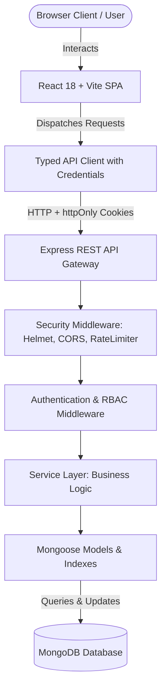
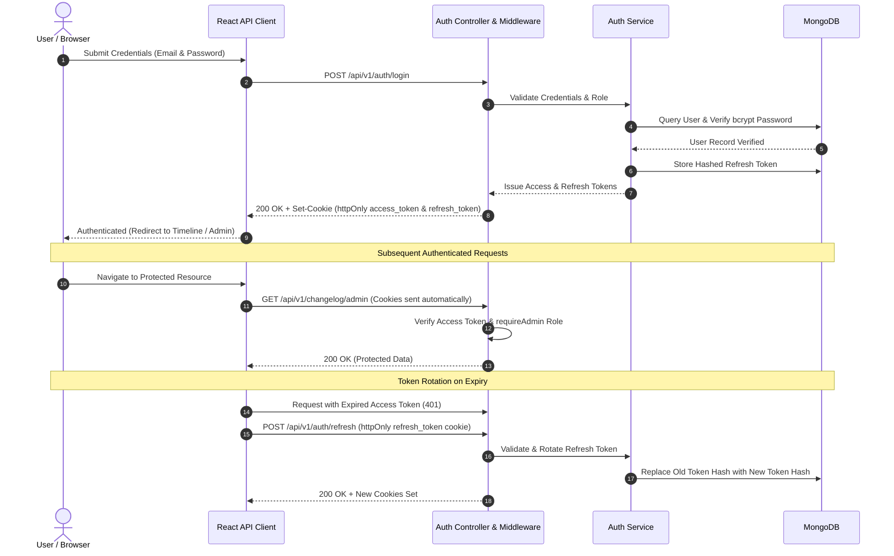

# ReleaseHub

ReleaseHub is a modern, full-stack product changelog and release communication platform designed to keep users informed and engaged with software updates. Built with a production-grade TypeScript architecture across both the Express REST API and the React single-page application, it provides an editorial public timeline, an administrative content workspace, interactive user reactions, unread notification tracking, debounced search and filtering, and a public JSON feed.

---

## Table of Contents

- [Overview](#overview)
- [Features](#features)
- [Tech Stack](#tech-stack)
- [Architecture](#architecture)
- [Project Structure](#project-structure)
- [Getting Started](#getting-started)
- [Environment Variables](#environment-variables)
- [Running the Application](#running-the-application)
- [Authentication & Security](#authentication--security)
- [API Documentation](#api-documentation)
- [Database](#database)
- [Testing](#testing)
- [UI/UX](#uiux)
- [Assessment Requirements](#assessment-requirements)
- [Git Commit History](#git-commit-history)
- [Future Improvements](#future-improvements)
- [License](#license)

---

## Overview

Software teams often struggle to communicate product velocity and feature updates effectively to their community, while end users miss important improvements buried in commit logs. ReleaseHub bridges this gap by providing:

- **For End Users & Community Members**: A clean, accessible chronological feed of product releases, deep-linkable update permalinks, rich Markdown descriptions, category filtering (`New`, `Improved`, `Fixed`), full-text search, multi-emoji reactions (`❤️ Heart`, `🎉 Celebrate`, `🚀 Rocket`), and a "What's New" notification center that highlights unread updates since their last visit.
- **For Product Administrators**: A protected administrative workspace featuring changelog drafting and publishing workflows, live Markdown editing with preview, cover image upload support, category assignment, and an analytics insights dashboard aggregating community engagement metrics and publication statistics.
- **Public & System Integration**: A publicly accessible syndicated JSON feed (`/api/v1/changelog/feed`) allowing external syndication, RSS readers, or third-party webhooks to consume published changelogs automatically.

---

## Features

### Public Experience
- **Reverse Chronological Timeline**: Clean, editorial timeline displaying published product updates ordered by publication date.
- **Dedicated Update Permalinks**: SEO-friendly slug-based routing (`/updates/:slug`) with category badges and author attribution.
- **Rich Markdown Rendering**: Formatted rendering of headings, bullet lists, blockquotes, inline code, syntax blocks, and links.
- **Category Filtering**: Instant category switching between `New`, `Improved`, and `Fixed` updates.
- **Debounced Keyword Search**: Client and server keyword search matching update titles, summaries, and Markdown body content.
- **Related Updates**: Context-aware recommendations suggesting other relevant releases sharing the same category.
- **Public JSON Feed**: Machine-readable JSON endpoint (`/api/v1/changelog/feed`) returning published releases for syndication.
- **Interactive Reactions**: Authenticated users can react with `❤️ Heart`, `🎉 Celebrate`, and `🚀 Rocket`. Reaction counts aggregate in real-time, enforce uniqueness per user-changelog-type tuple, and support instant toggling.
- **What's New Notification Center**: Dropdown notification panel indicating unread published updates based on user view timestamps with one-click "Mark all as read".
- **Responsive UI & Theme Switching**: Fluid layouts optimized for desktop, tablet, and mobile with full Light, Dark, and System appearance modes.

### Authentication & Security
- **Dual JWT Token Architecture**: Short-lived (15-minute) access tokens paired with long-lived (7-day) refresh tokens.
- **HTTP-Only Cookie Delivery**: Tokens transmitted exclusively via `httpOnly`, `SameSite=Lax` cookies; zero sensitive tokens stored in `localStorage` or `sessionStorage`.
- **Automatic Token Rotation**: Refresh tokens are single-use; each refresh cycle issues a new token pair and hashes the active token into the database.
- **Token Reuse Detection & Revocation**: Detecting previously consumed tokens invalidates the session family to prevent replay attacks.
- **Simulated Email Flows**: Verification tokens and password reset tokens generated with cryptographic hashes and automated MongoDB TTL expiry.
- **Role-Based Access Control (RBAC)**: Strict segregation between `user` and `admin` roles, enforced at both API routing and client component boundaries.
- **Defensive Middleware**: Comprehensive protection using Helmet HTTP headers, configurable CORS origin whitelisting, Express Rate Limiting on public and auth endpoints, and schema-driven input validation.

### Admin Workspace
- **Overview Dashboard**: High-level overview displaying aggregate changelog counts, publication metrics, and recent activity.
- **Changelog Lifecycle Management**: Full CRUD operations for updates with explicit `draft` and `published` lifecycle states.
- **Publish & Unpublish Controls**: Instant draft-to-published activation with automatic timestamping, or retraction back to draft mode.
- **Split-Pane Markdown Editor**: Integrated live-preview editor allowing real-time formatting verification before publication.
- **Metadata Management**: Category assignment, slug customization with duplicate collision detection, and cover image URL association.
- **Admin Insights Dashboard**: Visual breakdown of total releases, draft vs. published ratios, community member registrations, reaction distribution by type, and top-performing updates.
- **Workspace Settings**: Profile management, appearance preferences, notification toggles, and account session termination.

---

## Tech Stack

| Layer | Technologies | Purpose |
|---|---|---|
| **Frontend Framework** | React 18, TypeScript | Type-safe declarative single-page application UI |
| **Build & Tooling** | Vite 6 | Lightning-fast HMR and optimized production bundling |
| **Styling & Design** | Tailwind CSS v4, tw-animate-css | Modern utility-first responsive styling and animations |
| **UI Primitives** | Radix UI, Lucide React, Coss UI | Accessible, unstyled UI primitives and iconography |
| **Routing** | TanStack Router | Type-safe, file-based client-side routing |
| **Data Fetching & State** | TanStack Query, React Context | Server-state caching, optimistic updates, and reactive store |
| **Forms & Validation** | React Hook Form | High-performance form state management |
| **Visualizations** | Recharts | Interactive SVG charts for admin engagement insights |
| **Backend Runtime** | Node.js (>= 20.0.0), Express 4 | High-performance RESTful API server |
| **Language & Transpiler** | TypeScript 5, tsx | End-to-end static typing and runtime TypeScript execution |
| **Database & ODM** | MongoDB, Mongoose 8 | Document database with strict schemas and compound indexes |
| **Authentication & Crypto** | JSON Web Tokens (jsonwebtoken), bcryptjs | Cryptographic token signing and password hashing |
| **Security Middleware** | Helmet, CORS, Express Rate Limit, Cookie-Parser | HTTP header hardening, origin whitelisting, and rate throttling |
| **Testing** | Node.js Test Runner / TypeScript tsx | End-to-end automated backend test suites (96 tests) |
| **Version Control** | Git, GitHub | Structured 10-commit history and release versioning |

---

## Architecture

ReleaseHub adheres to a clean separation of concerns, decoupling the presentation client from the authoritative REST API server.

### System Architecture Flow



### Architectural Highlights

1. **Client-Server Decoupling**: The React application runs independently as a high-performance SPA, communicating with the Express API via JSON over HTTP.
2. **Stateless API with Stateful Token Tracking**: Authentication is verified via stateless short-lived JWT access tokens, while refresh tokens are tracked in MongoDB for immediate revocation capability.
3. **Defense-in-Depth Middleware Pipeline**: Every request flows through Helmet header enforcement, CORS origin verification, IP-based rate limiters, request body parsers, and route-level RBAC guards before reaching controller logic.
4. **Authoritative Service Layer**: All database interactions, business logic, slug deduplication, reaction aggregation, and unread computations reside within dedicated service modules.

### Authentication & Session Lifecycle



---

## Project Structure

```text
releasehub/
├── backend/                             # Authoritative Express + TypeScript REST API
│   ├── src/
│   │   ├── config/                      # Environment variables, database connection, and CORS origins
│   │   │   ├── database.ts
│   │   │   └── env.ts
│   │   ├── controllers/                 # HTTP request handlers
│   │   │   ├── admin.controller.ts
│   │   │   ├── auth.controller.ts
│   │   │   ├── changelog.controller.ts
│   │   │   ├── health.controller.ts
│   │   │   ├── notification.controller.ts
│   │   │   └── user.controller.ts
│   │   ├── middleware/                  # Security, auth, validation, and error middleware
│   │   │   ├── admin.middleware.ts
│   │   │   ├── auth.middleware.ts
│   │   │   ├── errorHandler.middleware.ts
│   │   │   ├── notFound.middleware.ts
│   │   │   ├── rateLimiter.middleware.ts
│   │   │   └── validation.middleware.ts
│   │   ├── models/                      # Mongoose schemas and compound indexes
│   │   │   ├── changelog.model.ts
│   │   │   ├── passwordResetToken.model.ts
│   │   │   ├── reaction.model.ts
│   │   │   └── user.model.ts
│   │   ├── routes/                      # Route registration and mapping
│   │   │   ├── admin.routes.ts
│   │   │   ├── auth.routes.ts
│   │   │   ├── changelog.routes.ts
│   │   │   ├── health.routes.ts
│   │   │   ├── index.ts
│   │   │   ├── notification.routes.ts
│   │   │   └── user.routes.ts
│   │   ├── services/                    # Core business logic layer
│   │   │   ├── admin.service.ts
│   │   │   ├── auth.service.ts
│   │   │   ├── changelog.service.ts
│   │   │   ├── notification.service.ts
│   │   │   └── user.service.ts
│   │   ├── utils/                       # Logging, token helpers, slug generation
│   │   │   ├── jwt.ts
│   │   │   ├── logger.ts
│   │   │   └── slug.ts
│   │   ├── validators/                  # Input validation schemas
│   │   │   ├── auth.validator.ts
│   │   │   ├── changelog.validator.ts
│   │   │   └── user.validator.ts
│   │   ├── app.ts                       # Express application initialization and middleware
│   │   └── server.ts                    # HTTP server entry point and graceful shutdown
│   ├── scripts/
│   │   └── seed.ts                      # Idempotent database index sync and account seed
│   ├── tests/                           # Comprehensive automated test suites (96 tests)
│   │   ├── auth.test.ts
│   │   ├── changelog.test.ts
│   │   ├── health.test.ts
│   │   └── milestone4.test.ts
│   ├── .env.example                     # Backend environment template
│   ├── package.json
│   └── tsconfig.json
│
├── frontend/                            # High-performance React 18 + Vite SPA
│   ├── public/                          # Static assets and favicon
│   ├── src/
│   │   ├── components/
│   │   │   ├── admin/                   # Markdown editor, update forms, stats cards, image uploader
│   │   │   ├── brand/                   # ReleaseHub logo and brand assets
│   │   │   ├── changelog/               # Timeline, reaction bar, category badges, markdown renderer
│   │   │   ├── common/                  # Empty states, loading skeletons, error states
│   │   │   ├── layout/                  # Public shell, admin shell, auth shell, theme toggle, admin guard
│   │   │   ├── notifications/           # What's New notification popover and unread badge
│   │   │   ├── search/                  # Keyboard command palette (cmdk)
│   │   │   └── ui/                      # Radix UI primitives and Coss UI components
│   │   ├── lib/                         # Formatting utilities and class merging
│   │   ├── routes/                      # File-based TanStack Router route definitions
│   │   │   ├── admin/                   # Dashboard, drafts, published, insights, settings, update edit
│   │   │   ├── updates/                 # Public updates feed and individual update permalink
│   │   │   ├── forgot-password.tsx
│   │   │   ├── index.tsx
│   │   │   ├── login.tsx
│   │   │   ├── reset-password.tsx
│   │   │   ├── signup.tsx
│   │   │   └── verify-email.tsx
│   │   ├── services/                    # API client and service endpoints
│   │   │   ├── api/apiClient.ts
│   │   │   ├── adminService.ts
│   │   │   ├── authService.ts
│   │   │   ├── changelogService.ts
│   │   │   ├── notificationService.ts
│   │   │   └── userService.ts
│   │   ├── store/                       # Application state (release-store, theme-store)
│   │   ├── styles.css                   # Tailwind CSS v4 variables and typography tokens
│   │   ├── main.tsx                     # React root bootstrap
│   │   ├── router.tsx                   # TanStack Router instance
│   │   └── vite-env.d.ts
│   ├── .env.example                     # Frontend environment template
│   ├── package.json
│   ├── tsconfig.json
│   └── vite.config.ts                   # Vite bundler configuration
│
├── .gitignore                           # Monorepo git ignore rules
└── README.md                            # Comprehensive project documentation
```

---

## Getting Started

### Prerequisites

Ensure the following runtimes and tools are installed locally:
- **Node.js**: `v20.0.0` or higher (`node -v`)
- **npm**: `v10.0.0` or higher (`npm -v`)
- **MongoDB**: Local MongoDB Community Edition running on port `27017` or a cloud MongoDB Atlas URI
- **Git**: Installed and available in PATH

### Clone

```bash
git clone <repository-url>
cd releasehub
```

### Backend Setup

1. Navigate to the backend directory and install dependencies:
   ```bash
   cd backend
   npm install
   ```

2. Create the local `.env` configuration file from the template:
   ```bash
   # Windows (PowerShell)
   Copy-Item .env.example .env

   # macOS / Linux
   cp .env.example .env
   ```

3. Initialize database indexes and seed default administrative credentials:
   ```bash
   npm run seed
   ```

   This verifies indexes and idempotently provisions:
   - **Administrator Account**: `aria@releasehub.dev` / `AdminPass123!` (Role: `admin`)
   - **Member Account**: `member@releasehub.dev` / `UserPass123!` (Role: `user`)

### Frontend Setup

1. Navigate to the frontend directory and install dependencies:
   ```bash
   cd ../frontend
   npm install
   ```

2. Create the local `.env` configuration file from the template:
   ```bash
   # Windows (PowerShell)
   Copy-Item .env.example .env

   # macOS / Linux
   cp .env.example .env
   ```

---

## Environment Variables

### Backend Configuration (`backend/.env`)

| Variable | Description | Default / Example Value |
|---|---|---|
| `PORT` | HTTP server port for the Express REST API | `5000` |
| `NODE_ENV` | Application runtime environment (`development`, `production`, `test`) | `development` |
| `MONGODB_URI` | MongoDB connection URI string | `mongodb://127.0.0.1:27017/releasehub` |
| `JWT_ACCESS_SECRET` | Secret key used to sign short-lived JWT access tokens | `dev_jwt_access_secret_change_in_prod` |
| `JWT_REFRESH_SECRET` | Secret key used to sign long-lived JWT refresh tokens | `dev_jwt_refresh_secret_change_in_prod` |
| `ACCESS_TOKEN_EXPIRES_IN` | Validity duration of access tokens | `15m` |
| `REFRESH_TOKEN_EXPIRES_IN` | Validity duration of refresh tokens | `7d` |
| `CLIENT_URL` | Allowed frontend origin(s), comma-separated | `http://localhost:5174,http://localhost:5173` |
| `COOKIE_SECURE` | Enable HTTPS-only flag on cookies (`true` in production) | `false` |
| `COOKIE_SAME_SITE` | SameSite cookie attribute (`lax`, `strict`, `none`) | `lax` |
| `RESET_PASSWORD_EXPIRES_MINUTES` | Expiration window for password reset tokens | `30` |

### Frontend Configuration (`frontend/.env`)

| Variable | Description | Default / Example Value |
|---|---|---|
| `VITE_API_BASE_URL` | Target base URL for backend API requests | `http://localhost:5000/api/v1` |

> [!IMPORTANT]
> **Security Notice**:
> - Never commit `.env` files containing real credentials to source control.
> - Always use `.env.example` as a template.
> - Replace all development secrets with cryptographically random keys before deploying to production.

---

## Running the Application

To run the complete system locally, start both the backend API and the frontend dev server in separate terminal windows:

### Terminal 1: Backend Server

```bash
cd backend
npm run dev
```
- **API Base URL**: `http://localhost:5000/api/v1`
- **Health Check**: `http://localhost:5000/api/v1/health`

### Terminal 2: Frontend Client

```bash
cd frontend
npm run dev
```
- **Web App URL**: `http://localhost:5173` (or `http://localhost:5174` if port 5173 is already occupied)

The backend dynamically supports standard development origins (`5173` and `5174`) out of the box with full cookie and credentials support.

---

## Authentication & Security

ReleaseHub implements a strict, defense-in-depth security model:

- **Token Storage**: Neither access tokens nor refresh tokens are ever accessible to client JavaScript via `localStorage` or `sessionStorage`, completely neutralizing Cross-Site Scripting (XSS) token theft.
- **HTTP-Only Cookies**: Tokens are dispatched using `Set-Cookie` with `HttpOnly`, `SameSite=Lax`, and configurable `Secure` flags.
- **Token Rotation & Invalidation**: Refresh tokens are single-use. When a refresh request is processed, the existing refresh token is invalidated, and a new token pair is issued. Refresh tokens are stored as SHA-256 hashes in MongoDB.
- **Session Revocation**: Logging out via `/api/v1/auth/logout` revokes the active refresh token hash from the database and clears cookies immediately.
- **Password Security**: Passwords must contain a minimum of 8 characters with upper, lower, numeric, and special characters, hashed using `bcryptjs` with salt work factor 12.
- **Role-Based Authorization (RBAC)**: Endpoints requiring administrative privileges are guarded by `requireAdmin`, enforcing `req.user.role === 'admin'`. Non-admin requests receive `403 Forbidden`.
- **CORS Whitelisting**: Strictly restricts origin reflection to configured frontend URLs, disallowing wildcards (`*`) while preserving credentials (`credentials: true`).
- **Rate Limiting**: Public endpoints are throttled to 100 requests per 15 minutes, while sensitive authentication routes (`/auth/login`, `/auth/signup`, `/auth/forgot-password`) are restricted to 10 requests per 15 minutes to prevent brute-force attacks.
- **HTTP Hardening**: Helmet middleware sets security headers including Content Security Policy, Frameguard (`SAMEORIGIN`), X-Content-Type-Options (`nosniff`), and Referrer Policy.

---

## API Documentation

All endpoints are versioned under the `/api/v1` prefix and return standardized JSON response envelopes:
- Success: `{ "success": true, "data": { ... } }`
- Error: `{ "success": false, "error": { "code": "ERROR_CODE", "message": "Description" } }`

### 1. System Health
| Method | Endpoint | Description | Auth Required |
|---|---|---|---|
| `GET` | `/api/v1/health` | Service health status and database connectivity | None |

### 2. Authentication
| Method | Endpoint | Description | Auth Required |
|---|---|---|---|
| `POST` | `/api/v1/auth/signup` | Register a new user account | None |
| `POST` | `/api/v1/auth/verify-email` | Verify user email address with token | None |
| `POST` | `/api/v1/auth/login` | Authenticate user & issue httpOnly cookies | None |
| `POST` | `/api/v1/auth/refresh` | Rotate refresh token & issue new access token | Refresh Cookie |
| `POST` | `/api/v1/auth/logout` | Revoke session and clear authentication cookies | Authenticated |
| `GET` | `/api/v1/auth/me` | Retrieve active authenticated session and role | Authenticated |
| `POST` | `/api/v1/auth/forgot-password` | Generate password reset token and instructions | None |
| `POST` | `/api/v1/auth/reset-password` | Reset password using verified reset token | None |

### 3. Public Changelogs & Reactions
| Method | Endpoint | Description | Auth Required |
|---|---|---|---|
| `GET` | `/api/v1/changelog` | Retrieve paginated published updates (filter/search) | None |
| `GET` | `/api/v1/changelog/feed` | Syndicated public JSON feed of releases | None |
| `GET` | `/api/v1/changelog/:slug` | Retrieve single published update by URL slug | None |
| `GET` | `/api/v1/changelog/:slug/related`| Retrieve related updates sharing the same category | None |
| `POST` | `/api/v1/changelog/:id/reactions`| Toggle reaction (`heart`, `celebrate`, `rocket`) | Authenticated |
| `DELETE`| `/api/v1/changelog/:id/reactions/:type` | Remove specific reaction from an update | Authenticated |

### 4. Admin Changelog Management
| Method | Endpoint | Description | Auth Required |
|---|---|---|---|
| `POST` | `/api/v1/changelog/admin` | Create a new changelog draft | Admin (`role: admin`) |
| `GET` | `/api/v1/changelog/admin` | List all changelogs (both draft and published) | Admin (`role: admin`) |
| `GET` | `/api/v1/changelog/admin/:id` | Retrieve single changelog details for editing | Admin (`role: admin`) |
| `PUT` | `/api/v1/changelog/admin/:id` | Update changelog metadata, title, or Markdown | Admin (`role: admin`) |
| `DELETE`| `/api/v1/changelog/admin/:id` | Permanently delete a changelog entry | Admin (`role: admin`) |
| `POST` | `/api/v1/changelog/admin/:id/publish` | Transition status to `published` and stamp date | Admin (`role: admin`) |
| `POST` | `/api/v1/changelog/admin/:id/unpublish` | Revert status to `draft` and hide from public | Admin (`role: admin`) |

### 5. Notifications ("What's New")
| Method | Endpoint | Description | Auth Required |
|---|---|---|---|
| `GET` | `/api/v1/notifications` | Fetch recent published updates with unread count | Authenticated |
| `POST` | `/api/v1/notifications/read` | Mark all notifications as read (updates timestamp) | Authenticated |

### 6. User Profile
| Method | Endpoint | Description | Auth Required |
|---|---|---|---|
| `GET` | `/api/v1/users/me` | Fetch authenticated user profile details | Authenticated |
| `PATCH`| `/api/v1/users/me` | Update display name (email and role are protected) | Authenticated |

### 7. Admin Insights
| Method | Endpoint | Description | Auth Required |
|---|---|---|---|
| `GET` | `/api/v1/admin/insights` | Aggregate statistics: totals, reactions, users | Admin (`role: admin`) |

---

## Database

ReleaseHub uses MongoDB with Mongoose to model structured, indexed entities:

### 1. `User` Schema
- `name`: Full display name of the user.
- `email`: Unique, lowercased email address (indexed).
- `passwordHash`: Salted bcrypt password hash.
- `role`: Role string, strictly restricted to `'user' \| 'admin'` (indexed).
- `isEmailVerified`: Boolean flag tracking verification state.
- `refreshTokens`: Array of active SHA-256 hashed refresh tokens.
- `lastViewedChangelogDate`: Timestamp tracking the last time the user reviewed the notification center.

### 2. `Changelog` Schema
- `title`: Release title (trimmed, max 120 chars).
- `slug`: Unique URL-friendly slug with automated duplicate suffixing (`update-1`, `update-2`).
- `summary`: Short plaintext summary.
- `contentMarkdown`: Full Markdown body content.
- `category`: Categorization enum (`'new' \| 'improved' \| 'fixed'`).
- `status`: Lifecycle enum (`'draft' \| 'published'`).
- `coverImageUrl`: Optional URL for banner/cover artwork.
- `author`: ObjectId reference to the `User` model who authored the release.
- `publishedAt`: Timestamp recorded upon transition to published.
- `reactionCounts`: Aggregated object tracking `{ heart: number, celebrate: number, rocket: number }`.
- **Indexes**: Compound index on `{ status: 1, publishedAt: -1 }` for high-throughput chronological feed queries, and `{ status: 1, category: 1, publishedAt: -1 }` for category filtering.

### 3. `Reaction` Schema
- `user`: ObjectId reference to the reacting `User`.
- `changelog`: ObjectId reference to the target `Changelog`.
- `type`: Emoji reaction type (`'heart' \| 'celebrate' \| 'rocket'`).
- **Indexes**: Unique compound index on `{ user: 1, changelog: 1, type: 1 }` enforcing strict uniqueness per reaction type.

### 4. `PasswordResetToken` Schema
- `user`: ObjectId reference to the `User`.
- `tokenHash`: SHA-256 hash of the reset token.
- `expiresAt`: Date timestamp backed by a native MongoDB TTL index (`expireAfterSeconds: 0`) for automatic self-cleaning.

---

## Testing

The backend includes a comprehensive, automated end-to-end integration test suite containing **96 verified tests** that execute directly against MongoDB:

```bash
cd backend
npm test
```

### Verified Test Breakdown

| Suite | File | Tests Passed | Key Areas Verified |
|---|---|---|---|
| **Health Check** | `tests/health.test.ts` | **1 / 1** | Server bootstrap, `/health` response envelope, service readiness |
| **Authentication & RBAC** | `tests/auth.test.ts` | **27 / 27** | Signup, login, httpOnly cookies, `/auth/me`, token rotation, password reset, 403 admin enforcement, rate limits |
| **Changelog & Reactions** | `tests/changelog.test.ts` | **42 / 42** | Draft CRUD, slug deduplication, publishing workflow, timeline queries, search, pagination, reaction toggling, JSON feed |
| **Notifications & Insights** | `tests/milestone4.test.ts` | **26 / 26** | What's New feed, unread tracking, mark-all-read, profile name update, admin insights aggregation |
| **Total Verified** | **All Suites** | **96 / 96** | **100% Passing** |

### Build Validation

Frontend TypeScript and asset bundling:
```bash
cd frontend
npm run build
```
*(Produces a production-ready, minified Vite bundle without TypeScript errors)*.

Backend TypeScript compilation:
```bash
cd backend
npm run build
```
*(Compiles cleanly into `dist/` with 0 TypeScript diagnostics)*.

---

## UI/UX

The ReleaseHub client interface is built with an emphasis on clarity, accessibility, and modern aesthetics:

- **Component Architecture**: Built using accessible Radix UI primitives and styled with a custom Coss UI design system using Tailwind CSS tokens.
- **Responsive Layouts**: Designed mobile-first, scaling seamlessly across smartphones, tablets, laptops, and ultra-wide displays.
- **Color Modes**: Native Dark, Light, and System theme synchronization managed via CSS variables.
- **Split-Screen Markdown Authoring**: Admin form provides side-by-side editing and live preview rendering for rapid content authoring.
- **Quick Navigation Command Palette**: Integrated keyboard-driven shortcut palette (`Cmd/Ctrl + K`) powered by `cmdk` for instant jumping between updates, categories, and admin views.
- **State Handling**: Comprehensive UI states covering loading skeletons, optimistic reaction clicks, empty search queries, and contextual error banners.

---

## Assessment Requirements

The following matrix illustrates how every technical requirement of the assessment is implemented:

| Assessment Requirement | Technical Implementation |
|---|---|
| **Dual JWT Authentication** | Short-lived 15m access tokens and 7d refresh tokens delivered via httpOnly cookies |
| **Role-Based Access Control** | Explicit `user` and `admin` roles; protected API middleware (`requireAdmin`) and frontend `AdminGuard` |
| **Changelog Management** | Full admin CRUD for updates with `draft` and `published` lifecycle states |
| **Markdown Support** | Real-time split-pane Markdown editor in admin with sanitized frontend rendering |
| **Categorization** | `New`, `Improved`, and `Fixed` categories with filtering and badge presentation |
| **Interactive Reactions** | Heart, Celebrate, and Rocket emoji reactions with unique compound indexes and live count aggregation |
| **Notification Center** | "What's New" dropdown with unread badge tracking calculated from `lastViewedChangelogDate` |
| **Full-Text Search** | Debounced keyword query searching titles, summaries, and Markdown body content |
| **Public JSON Feed** | Public syndicated release feed endpoint (`/api/v1/changelog/feed`) |
| **Database Architecture** | MongoDB with Mongoose schemas, compound indexes, and TTL self-expiring reset tokens |
| **Security Hardening** | Helmet HTTP headers, CORS origin whitelisting with credentials, and Express Rate Limiting |
| **Clean 10-Commit Git History** | Exactly 10 meaningful, structured commits documenting the evolution of the repository |

---

## Git Commit History

The repository intentionally maintains **EXACTLY 10 meaningful commits** in chronological order, representing the complete full-stack milestone progression:

```text
1. initialize backend architecture
2. add database models and configuration
3. add express security and health endpoint
4. complete verification and documentation
5. add authentication and authorization system
6. add changelog management and reactions
7. add notifications profiles and admin insights
8. integrate releasehub frontend
9. connect frontend to releasehub api
10. finalize releasehub verification and documentation
```

---

## Future Improvements

The following architectural enhancements are planned for future production scaling:

- **Cloud Object Storage**: Integrating AWS S3 or Cloudflare R2 for direct CDN-backed cover image uploads.
- **Transactional Email Integration**: Replacing simulated verification/reset tokens with an email provider (Resend, SendGrid, or AWS SES).
- **Automated E2E Testing**: Implementing Playwright or Cypress suites for automated regression testing across browser viewports.
- **CI/CD Automation**: Configuring GitHub Actions workflows for continuous integration testing, linting, and Docker container deployments.
- **Webhook Subscriptions**: Enabling third-party webhook dispatch when new changelogs transition to published status.

---

## License

This project is licensed under the MIT License.

See the [LICENSE](LICENSE) file for the full license text.
